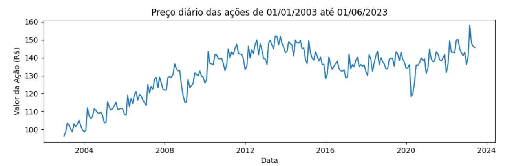
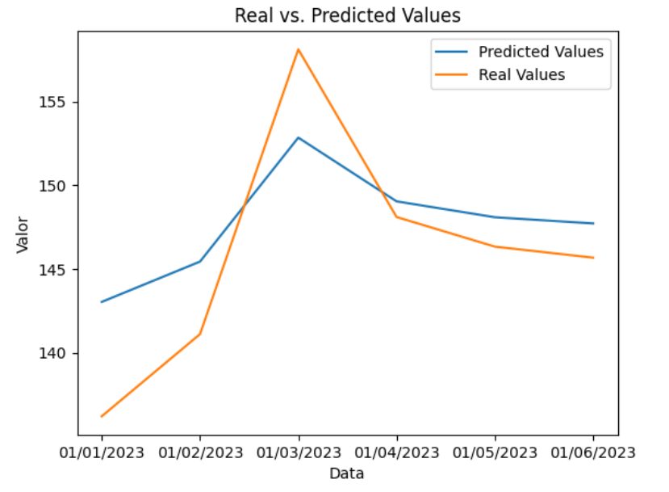
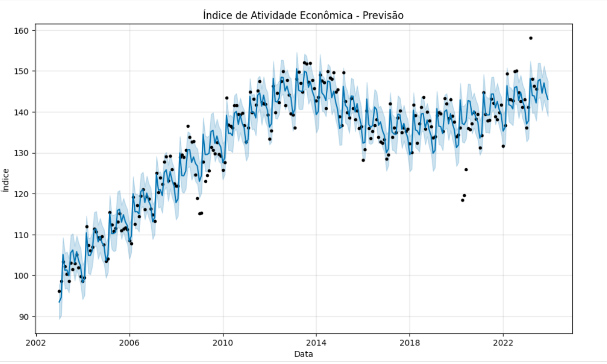
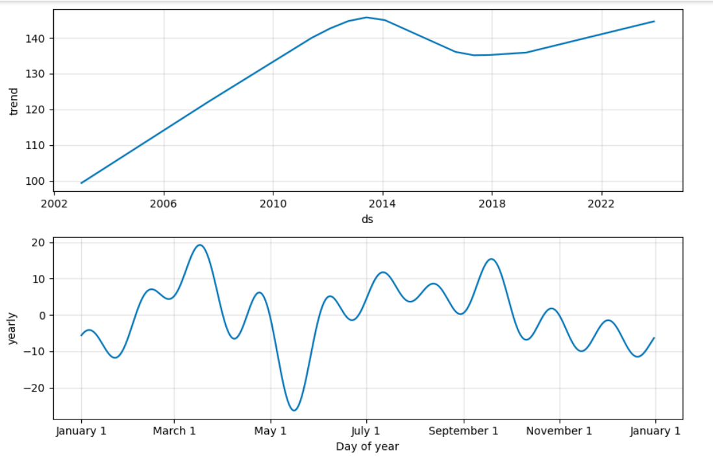

## redes-neurais

### Repositório Dedicado ao Aprendizado de Redes Neurais Artificiais

Desafio 1: Análise de Séries Temporais e Predição

Gráficos gerados pelo modelo MLP (Multilayer Perceptron):

<figure>
  

    
</figure>

<figure>
  

    
</figure>

Gráficos gerados pelo modelo Prophet

<figure>
  

    
</figure>

<figure>
  

    
</figure>